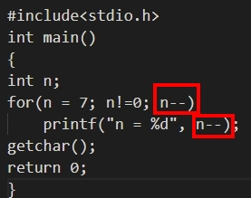

# 題目連結
https://www.geeksforgeeks.org/output-of-a-program-set-1/

<br/>

# Q1
## Predict the output of below programs.
```
#include<stdio.h>
int main()
{
    int n;
    for(n = 7; n!=0; n--)
        printf("n = %d", n--);
    getchar();
    return 0;
}
```
## Output
無限迴圈，原因是fot 迴圈裡總共執行了2次 n--



所以n的值跳動會變成7,5,3,1,-1...... ，因此為無限迴圈。

<br/>

# Q2
```
#include<stdio.h>
int main()
{
    printf("%x", -1<<1);
    getchar();
    return 0;
}

```
1 => 0000 0001

-1 => 1111 1110 +1
    => 1111 1111

-1 << 1 =>1111 1110 (左移1位) (8bits)

所以電腦若是16bits，則應該為 1111 1111 1111 1110 (fffe)

所以電腦若是32bits，則應該為 1111 1111 1111 1111 1111 1111 1111 1110 (ffff fffe)

<br/>

# Q3
```
# include <stdio.h>
# define scanf "%s Geeks For Geeks "

main()
{
    printf(scanf, scanf);
    getchar();
    return 0;
}
```
這題考的是 define 的功能為替換文本
，因此應該要顯示的為:" %s Geeks For Geeks" "%s Geeks For Geeks "

但由於兩個 "" 相遇會自動連接字串變成 : " %s Geeks For Geeks Geeks For Geeks "

<br/>

# Q4

```
#include <stdlib.h>
#include <stdio.h>

enum {false, true};
int main()
{
    int i = 1;
    do
    {
        printf("%d\n", i);
        i++;
        if (i < 15)
            continue;
    } while (false);

getchar();
return 0;
}
```
這題考的是enum {false, true};

enum 分別依順序把false設成0 true設成1
因此do while 會至少做一次，i = 1，

while(false) = while(0) 跳出迴圈
印出來的答案為1


<br/>

# Q5
```
char *getString()
{
    char *str = "Nice test for strings";
    return str;
}

int main()
{
    printf("%s", getString());
    getchar();
    return 0;
}
```
char *str = "Nice test for strings" 叫做指向"Nice test for strings" 的字元指標 str

因此 printf("%s", getString()) 因此會直接print(str)

<br/>
